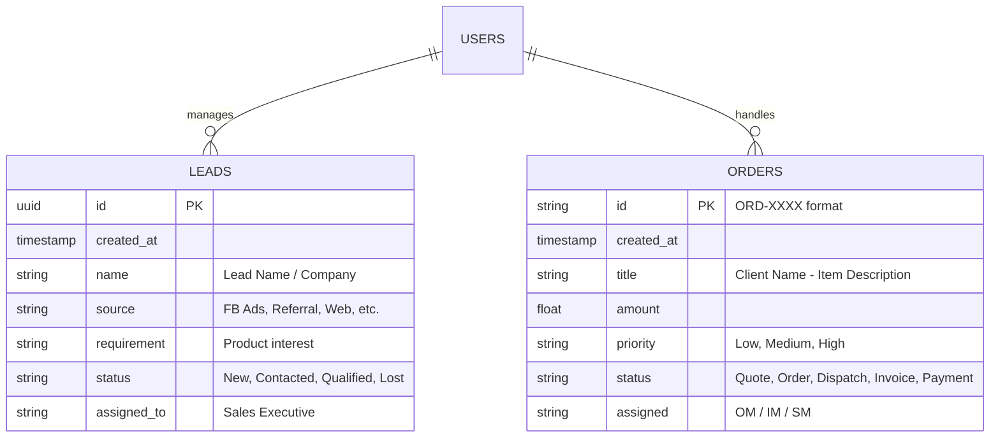
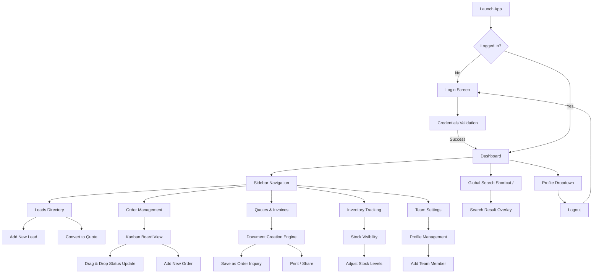

# Aster Lite Operations OS

A high-performance Manufacturing & Operations OS built for B2B lighting manufacturers. Developed by **Dhaval Trivedi**, this platform provides a seamless interface for managing leads, orders, inventory, and team settings.

## 🚀 Experience the UI
The application features a premium, modern B2B SaaS aesthetic with a clean split-screen login, smooth transitions, and a dark-themed visual sidebar.

### 🔑 Demo Credentials
You can log in and test the various role-based viewpoints using these dummy accounts:

| Role | Email | Password |
| :--- | :--- | :--- |
| **Admin** | `admin@gmail.com` | `Abcd@1234` |
| **Manager** | `manager@gmail.com` | `Abcd@1234` |
| **Sales** | `sales@gmail.com` | `Abcd@1234` |
| **Inventory** | `inventory@gmail.com` | `Abcd@1234` |

*Note: These accounts are hardcoded for preview bypass to avoid Supabase rate limits during testing.*

---

## 🛠 Tech Stack
- **Frontend**: Single Page Application (SPA) built with pure **HTML5**, **CSS3**, and **Vanilla JavaScript**.
- **Icons**: [Boxicons](https://boxicons.com/) for a sleek corporate look.
- **Typography**: [Inter](https://fonts.google.com/specimen/Inter) font family for maximum readability.
- **Backend / DB**: [Supabase](https://supabase.com/) (PostgreSQL) for real-time data persistence and Authentication.
- **Routing**: Hash-based routing for persistent views on page refresh.

---

## 📊 Database Architecture (ERD)

The system is powered by a robust Supabase backend. Below is the conceptual Entity Relationship Diagram:

---

## 🗺️ User Flow

The following flow chart illustrates the primary navigation path and core interactions within the Operations OS:

---

## ✨ Features
- **Dashboard**: High-level overview of daily operations and metrics.
- **Leads Directory**: Centralized hub for incoming inquiries with auto-routing capability.
- **Order Management**: Life-cycle tracking from Quote to Payment.
- **Inventory Tracking**: Real-time stock visibility and adjustment tools.
- **Team Settings**: User management, profile updates, and security configurations.
- **Global Search**: Quick navigation using context-aware search (Shortcut: `/`).

## ⚙️ Setup
1. Clone the repository.
2. Rename `.env.example` to `.env`.
3. Add your Supabase credentials.
4. Open `index.html` in any modern browser or host it on Vercel/Netlify.

---
Developed with ❤️ by **Dhaval Trivedi**
